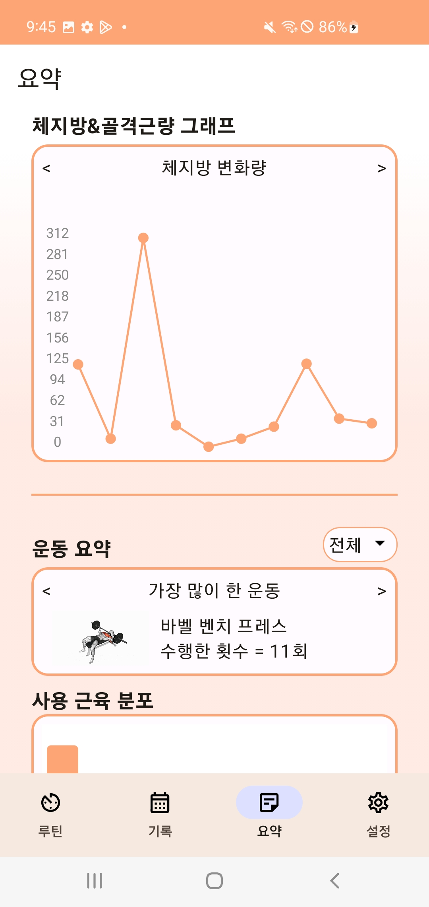

# 모근 (모두의 근육)

SSAFY 9기 2학기 자율 프로젝트 23.10.10 ~ 23.11.17 (6주)

## 효율적이고 안전한 운동을 위해

## 목차

1. [프로젝트 소개](#프로젝트-소개)
2. [하드웨어 소개](#하드웨어-소개)
3. [기능 소개](#기능-소개)
4. [프로젝트 아키텍처](#프로젝트-아키텍처)
5. [팀원 소개](#팀원-소개)

---

## 프로젝트 소개

#### [모근]은 근전도 센서를 사용자의 근육에 부착하여 운동 중 발생하는 다양한
#### 근육 신호를 수집, 분석, 출력하여 어플리케이션을 통해 보여줌으로써
#### 사용자가 효율적이고 안전하게 운동할 수 있도록 보조해주고자 합니다.

## 하드웨어 소개

### 근전도 신호를 받아와 BLE를 사용하여 전송해주는 하드웨어 입니다.
- 내부 모습

- 회로도

## 기능 소개

- ### 근 활성도 측정

    
    #### 사용자가 현재 부착한 부위에 대해 제대로 운동이 되고 있는지 실시간으로 확인할 수 있습니다.

- ### 근 피로도 측정

    
    #### 사용자가 세트를 수행할수록 피로도의 변화를 보여주며, 이를 통해 무리한 근육 운동을 수행하는지 아닌지 확인하여 부상 위험을 예방할 수 있습니다.

- ### 양쪽 근육의 균형도 측정
    
    
    #### 사용자가 수행한 운동이 양쪽 근육을 사용할 경우 한쪽만 불균형하게 사용하고 있는 게 아닌지 판단하여 올바른 운동으로 이끌어줍니다.
    
- ### 나만의 루틴 생성

    
    #### 정해진 형식이 아닌, 사용자가 직접 루틴을 만들고 원하는 운동을 선택 및 편집하여 커스터마이징할 수 있습니다.

- ### 운동 결과 리뷰

    
    #### 하나의 루틴을 마쳤으면 그 결과를 알려줍니다. 사용자는 이를 통해 지난 루틴을 리뷰하면서 어떤 점이 좋았고 부족했는지 확인할 수 있습니다.

- ### 요약 페이지

    
  
    #### 사용자가 지금까지 변화한 골격근량, 체지방량의 변화 추이를 그래프로 나타냅니다. 더불어 가장 많은 세트를 수행한 운동, 가장 무거운 중량을 수행한 운동 등 각종 최고 기록을 확인할 수 있습니다. 

## 프로젝트 아키텍처

#### 프로젝트 아키텍처는 다음과 같습니다.

## 팀원 소개

### 프로젝트를 함께한 구성원들을 소개합니다.

